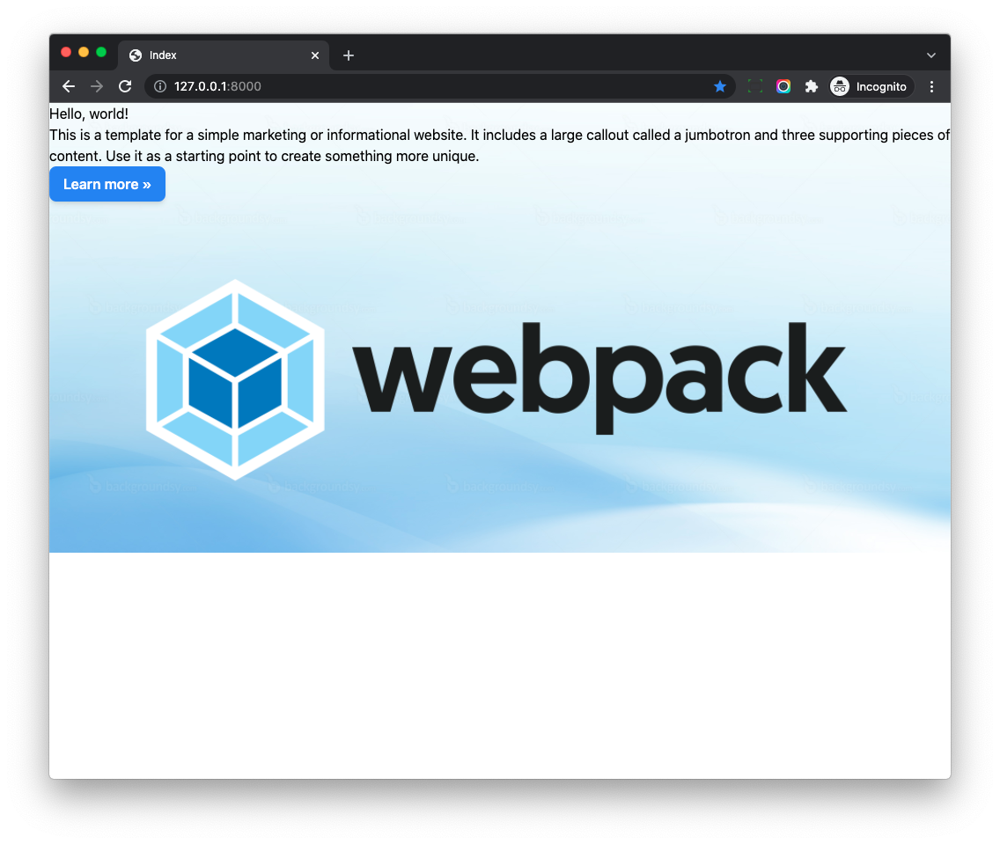
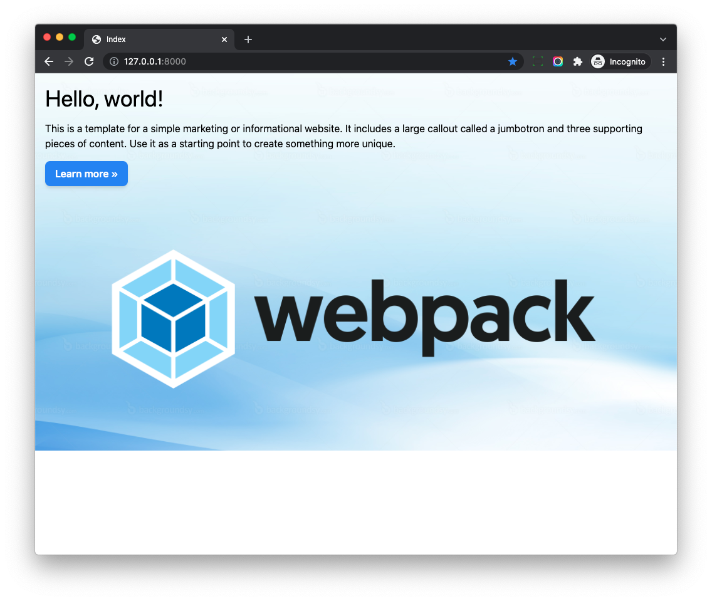

# Create Project

## Objective

1. Create a Django project
1. Use `python-webpack-boilerplate` to jump start frontend project bundled by Webpack.
1. Import Tailwind CSS as the styling solution.
1. Setup Live Reload with `webpack-dev-server`

## Create Django Project

I recommend to use Python 3.9+

```bash
$ mkdir hotwire_django_project && cd hotwire_django_project
$ python3 -V
Python 3.10.10

# create virtualenv and activate it
$ python3 -m venv venv
$ source venv/bin/activate
```

You can also use other tools such as [Poetry](https://python-poetry.org/) or [Pipenv](https://pipenv.pypa.io/)

Create *requirements.txt*

```
django==4.2
```

```bash
(venv)$ pip install -r requirements.txt
(venv)$ django-admin startproject hotwire_django_app .
```

The last `.` in the command means **creating the Django project in the current directory**.

You will see structure like this

```bash
.
├── hotwire_django_app
├── venv
├── manage.py
└── requirements.txt
```

Now, let's get the project running on local env.

```bash
# create db tables
(venv)$ python manage.py migrate
(venv)$ python manage.py runserver
```

Check on [http://127.0.0.1:8000/](http://127.0.0.1:8000/), and you should be able to see the Django welcome page

If it is working, press `Ctrl + C` to terminate the server.

## Install python-webpack-boilerplate

Next, we will add modern frontend tooling to the Django project, so we can use the latest frontend technologies such as ES6, Tailwind CSS, etc.

> python-webpack-boilerplate can help you jump start a frontend project that is bundled by Webpack

Add `python-webpack-boilerplate` to the *requirements.txt*

```
python-webpack-boilerplate==1.0.1  # new
```

And then install the package

```bash
(venv)$ pip install -r requirements.txt
```

Update *hotwire_django_app/settings.py* to add 'webpack_boilerplate' to `INSTALLED_APPS`

```python
INSTALLED_APPS = [
    'django.contrib.admin',
    'django.contrib.auth',
    'django.contrib.contenttypes',
    'django.contrib.sessions',
    'django.contrib.messages',
    'django.contrib.staticfiles',

    'webpack_boilerplate',               # new
]
```

Let's run Django command to create frontend project from the `python-webpack-boilerplate`

```bash
$ python manage.py webpack_init

project_slug [frontend]:
run_npm_command_at_root [n]: y
[SUCCESS]: Frontend app 'frontend' has been created. 
```

Here we set `run_npm_command_at_root` to `y` so we can run `npm` command directly **at the root of the Django project**

If we check the project structure, we will see something like this

```
.
├── db.sqlite3
├── frontend
├── hotwire_django_app
├── manage.py
├── package-lock.json
├── package.json
├── postcss.config.js
├── requirements.txt
└── venv
```

Notes:

1.  A new `frontend` directory is created which contains predefined files for our frontend project.
1. `package.json` and some other config files are placed at the root directory.

## Run Frontend Project

If you have no nodejs installed, please install it first by using below links

1. On [nodejs homepage](https://nodejs.org/en/download/)
1. Using [nvm](https://github.com/nvm-sh/nvm) or [fnm](https://github.com/Schniz/fnm) I recommend this way.

```bash
$ node -v
v18.12.1
$ npm -v
8.19.2
```

```bash
# install frontend dependency packages
$ npm install

# launch webpack dev server
$ npm run start
```

If the command run without error, that means the setup works, let's terminate the `npm run start` by pressing `Ctrl + C`

## Install Tailwind

By default `Python Webpack Boilerplate` does not contain `Tailwind CSS` (it is just a boilerplate), let's add it.

```bash
# install packages
$ npm install -D tailwindcss@latest postcss-import
```

You should see something like this in the *package.json*

```
"postcss-import": "^15.1.0",
"tailwindcss": "^3.3.2",
```

Next, let's edit *postcss.config.js*

```js
// https://tailwindcss.com/docs/using-with-preprocessors

module.exports = {
  plugins: {
    'postcss-import': {},
    'tailwindcss/nesting': 'postcss-nesting',
    tailwindcss: {},
    'postcss-preset-env': {
      features: { 'nesting-rules': false },
    },
  }
}
```

Next, generate a config file for your frontend project using the Tailwind CLI utility included when you install the `tailwindcss` npm package

```bash
$ npx tailwindcss init
```

Now *tailwind.config.js* is generated

```js
module.exports = {
    content: [],
    theme: {
        extend: {},
    },
    plugins: [],
}
```

This config file can customize Tailwind CSS and we will update it in later chapters.

For now, let's leave it as it is.

## Write Tailwind CSS

Update *src/application/app.js*

```js
// This is the scss entry file
import "../styles/index.scss";

window.document.addEventListener("DOMContentLoaded", function () {
  window.console.log("dom ready");
});
```

Update *src/styles/index.scss*

```scss
@import "tailwindcss/base";
@import "tailwindcss/components";
@import "tailwindcss/utilities";

.jumbotron {
  // should be relative path of the entry scss file
  background-image: url("../../vendors/images/sample.jpg");
  background-size: cover;
}

.btn-blue {
  @apply inline-flex items-center;
  @apply px-4 py-2;
  @apply font-semibold rounded-lg shadow-md;
  @apply text-white bg-blue-500;
  @apply hover:bg-blue-700 focus:outline-none focus:ring-2 focus:ring-blue-400 focus:ring-opacity-75;
}
```

Notes:

1. We use `@import` to import Tailwind CSS at the top
2. We use classic CSS syntax to write style for `jumbotron` class
3. We use `@apply` to apply Tailwind CSS utility classes to the `btn-blue` class

Let's test again.

```bash
$ npm run start
```

Now the tailwindcss can be compiled successfully, let's test in the Django template.

## Test in Django Template

Add code below to *hotwire_django_app/settings.py*

```python
STATICFILES_DIRS = [
    str(BASE_DIR / "frontend/build"),
]

WEBPACK_LOADER = {
    'MANIFEST_FILE': str(BASE_DIR / "frontend/build/manifest.json"),
}
```

1. We add the above `frontend/build` to `STATICFILES_DIRS` so Django can find the static assets built by our Webpack (img, font and others)
1. We add `MANIFEST_FILE` location to the `WEBPACK_LOADER` so our custom loader can help us load the JS and CSS.

Update *hotwire_django_app/urls.py*

```python
from django.contrib import admin
from django.urls import path
from django.views.generic import TemplateView

urlpatterns = [
    path('', TemplateView.as_view(template_name="index.html")),     # new
    path('admin/', admin.site.urls),
]
```

Create a folder for templates

```bash
$ mkdir hotwire_django_app/templates

├── hotwire_django_app
│   ├── __init__.py
│   ├── asgi.py
│   ├── settings.py
│   ├── templates               # new
│   ├── urls.py
│   └── wsgi.py
```

Update `TEMPLATES` in `hotwire_django_app/settings.py`, so Django can know where to find the templates

```python
TEMPLATES = [
    {
        'BACKEND': 'django.template.backends.django.DjangoTemplates',
        'DIRS': ['hotwire_django_app/templates'],                             # new
        'APP_DIRS': True,
        'OPTIONS': {
            'context_processors': [
                'django.template.context_processors.debug',
                'django.template.context_processors.request',
                'django.contrib.auth.context_processors.auth',
                'django.contrib.messages.context_processors.messages',
            ],
        },
    },
]
```

Add `index.html` to the above `hotwire_django_app/templates`

```html


<!DOCTYPE html>
<html>
<head>
  <title>Index</title>
  <meta charset="utf-8" />
  <meta name="viewport" content="width=device-width, initial-scale=1.0">
  
</head>
<body>

<div class="jumbotron py-5">
  <div class="w-full max-w-7xl mx-auto px-4">
      <h1 class="text-4xl mb-4">Hello, world!</h1>
      <p class="mb-4">This is a template for a simple marketing or informational website. It includes a large callout called a
        jumbotron and three supporting pieces of content. Use it as a starting point to create something more unique.</p>

      <p><a class="btn-blue mb-4" href="#" role="button">Learn more »</a></p>

      <div class="flex justify-center">
        
      </div>
  </div>
</div>



</body>
</html>
```

1. We `load webpack_loader` at the top of the template, which comes from the `python-webpack-boilerplate`
1. We can still use Django `static` template tag to import images from the frontend project.
1. We use `stylesheet_pack` and `javascript_pack` to load CSS and JS bundle files to Django

```bash
# please make sure 'npm run start' is still running
(venv)$ python manage.py migrate
(venv)$ python manage.py runserver
```

Now check on [http://127.0.0.1:8000/](http://127.0.0.1:8000/) and you should be able to see a welcome page.



Here we can notice:

1. The button style `btn-blue` is working.
1. Some styles in the Django templates such as `w-full max-w-7xl mx-auto px-4` is not working.

## JIT

From Tailwind V3, it enabled `JIT` (Just-in-Time) all the time.

> Tailwind CSS works by scanning all of your HTML, JavaScript components, and any other template files for class names, then generating all of the corresponding CSS for those styles.

> In order for Tailwind to generate all of the CSS you need, it needs to know about every single file in your project that contains any Tailwind class names.

So we should config the `content` section of the `tailwind.config.js`, then Tailwind will know which css classes are used.

Let's update *tailwind.config.js*

```js
const Path = require("path");
const pwd = process.env.PWD;

// We can add current project paths here
const projectPaths = [
    Path.join(pwd, "./hotwire_django_app/templates/**/*.html"),
    // add js file paths if you need
];

const contentPaths = [...projectPaths];
console.log(`tailwindcss will scan ${contentPaths}`);

module.exports = {
    content: contentPaths,
    theme: {
        extend: {},
    },
    plugins: [],
}
```

Notes:

1. Here we add Django templates path to the `projectPaths`
1. And then we pass the `contentPaths` to the `content`
1. The final built css file will contain css classes used in the Django templates

```bash
# restart webpack
$ npm run start

tailwindcss will scan hotwire_django_project/hotwire_django_app/templates/**/*.html
```



## Setup Live Reload

With `webpack-dev-server`, we can use it to auto reload the web page when the code of the project changes.

Update *frontend/webpack/webpack.config.dev.js*

```js
devServer: {
  // add this
  watchFiles: [
    Path.join(__dirname, '../../hotwire_django_app/**/*.py'),
    Path.join(__dirname, '../../hotwire_django_app/**/*.html'),
  ],
},
```

Let's restart webpack dev server.

```bash
$ npm run start
```

1. Here we tell webpack-dev-server to watch all `.py` and `.html` files under the `hotwire_django_app` directory.
1. Now if we change code in the editor, **the web page will auto reload automatically**, which is awesome!

More details can be found on [Python Webpack Boilerplate Doc](https://python-webpack-boilerplate.readthedocs.io/en/latest/live_reload/)

## django-tailwind

Some people might ask, why not use some pacakge like `django-tailwind` to setup Tailwind CSS in Django?

Well, `django-tailwind` can indeed help setup Tailwind CSS in Django, but it **does not contain anything about organizing Javascript code**, which makes it very tricky to make it work with Hotwire.

[python-webpack-boilerplate](https://github.com/AccordBox/python-webpack-boilerplate) already did that for developers and it's very easy to use. (In most cases, developers do not need to change anything in the config files.)

We will see this in later chapters.
