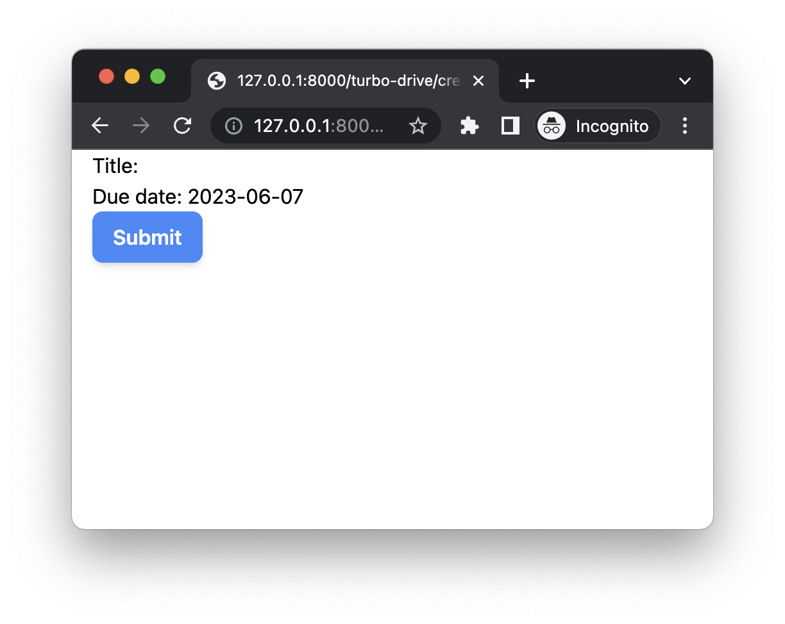
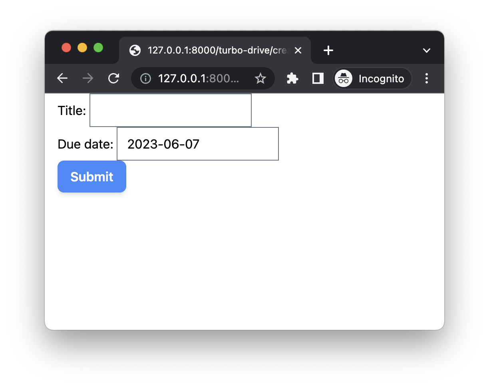
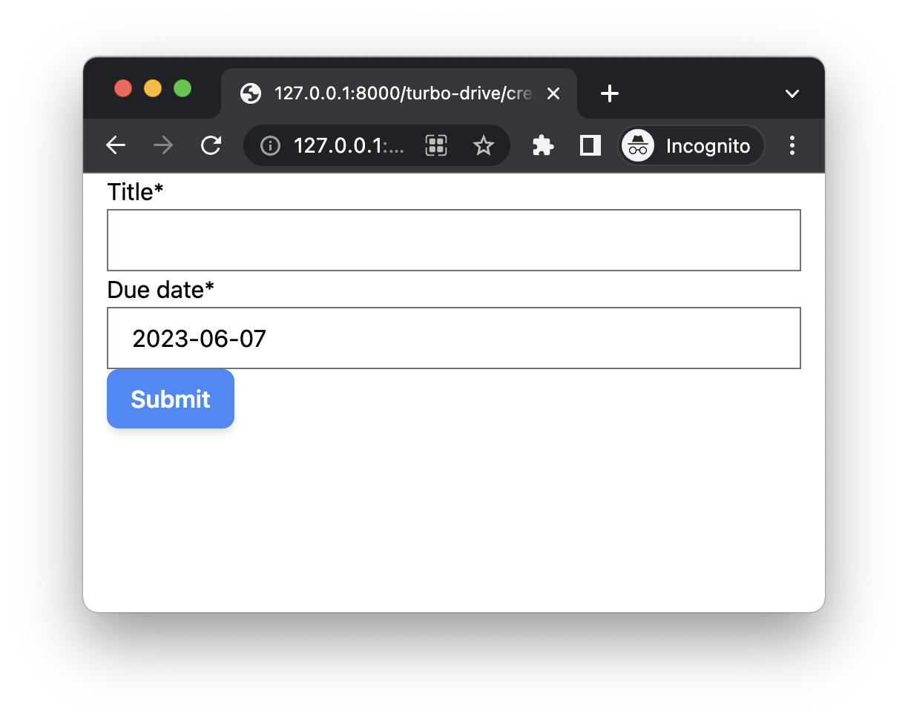
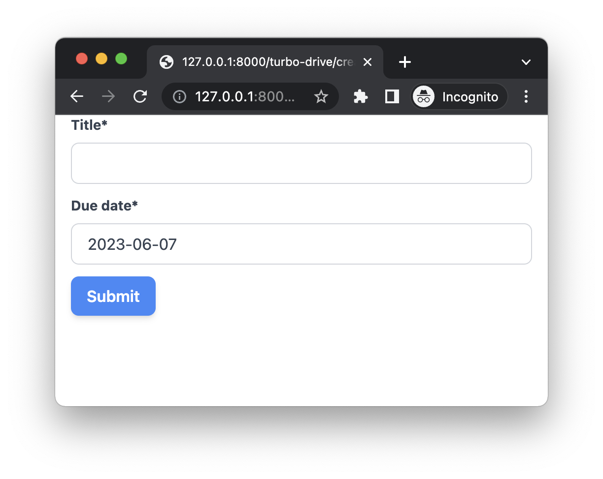

# Render Django Form with Tailwind CSS Styles

## Objectives

1. Render Django form with Tailwind CSS

## Django App

Let's create a `turbo_drive` app, we will learn how `Turbo Drive` works with this Django app.

```bash
(venv)$ mkdir -p ./hotwire_django_app/turbo_drive
(venv)$ python manage.py startapp turbo_drive ./hotwire_django_app/turbo_drive
```

We will have structure like this:

```
├── hotwire_django_app
│   ├── __init__.py
│   ├── asgi.py
│   ├── settings.py
│   ├── tasks
│   ├── templates
│   ├── turbo_drive                       # new
│   │   ├── __init__.py
│   │   ├── admin.py
│   │   ├── apps.py
│   │   ├── migrations
│   │   ├── models.py
│   │   ├── tests.py
│   │   └── views.py
│   ├── urls.py
│   └── wsgi.py
```

Update *hotwire_django_app/turbo_drive/apps.py* to change the name to `hotwire_django_app.turbo_drive`

```python
from django.apps import AppConfig


class TurboDriveConfig(AppConfig):
    default_auto_field = 'django.db.models.BigAutoField'
    name = 'hotwire_django_app.turbo_drive'              # update
```

Add `hotwire_django_app.turbo_drive` to the `INSTALLED_APPS` in *hotwire_django_app/settings.py*

```python
INSTALLED_APPS = [
	...
    'hotwire_django_app.turbo_drive',                  # new
]
```

```bash
# check if there is any error
(venv)$ ./manage.py check

System check identified no issues (0 silenced).
```

## View

Create *hotwire_django_app/turbo_drive/views.py*

```python
from django.shortcuts import render, redirect

from hotwire_django_app.tasks.forms import TaskForm


def create_view(request):
    if request.method == 'POST':
        form = TaskForm(request.POST)
        if form.is_valid():
            form.save()

            return redirect('/')
    else:
        form = TaskForm()

    return render(request, 'turbo_drive/create.html', {'form': form})
```

Here we create a simple Django FBV (function-based view), user can create tasks on the form page.

## Template

Create *hotwire_django_app/templates/turbo_drive/base.html*

```html


<!DOCTYPE html>
<html>
<head>
  <meta charset="utf-8" />
  <meta name="viewport" content="width=device-width, initial-scale=1.0">

  
  
</head>
<body>




</body>
</html>
```

Notes:

1. We already created `turbo_drive` JS application file and CSS file in the previous chapter, we import them to the Django template here.

Create *hotwire_django_app/templates/turbo_drive/create.html*

```html




<div class="w-full max-w-7xl mx-auto px-4">

  <form method="post">
    

    {{ form.as_p }}

    <button type="submit" class="btn-blue">Submit</button>
  </form>

</div>


```

## URL

Create *hotwire_django_app/turbo_drive/urls.py*

```python
from django.urls import path
from .views import create_view

app_name = 'turbo-drive'

urlpatterns = [
    path('create/', create_view, name='task-create'),
]
```

Notes:

1. Here we use the `app_name` to set the `namespace` of the Django app.

Update *hotwire_django_app/urls.py*

```python
from django.contrib import admin
from django.urls import path, include               # update
from django.views.generic import TemplateView

urlpatterns = [
    path('', TemplateView.as_view(template_name="index.html")),
    path('turbo-drive/', include('hotwire_django_app.turbo_drive.urls')),       # new
    path('admin/', admin.site.urls),
]
```

## Manual test

```bash
# make sure 'npm run start' is running
(venv)$ python manage.py runserver
```

If we check on [http://127.0.0.1:8000/turbo-drive/create/](http://127.0.0.1:8000/turbo-drive/create/)



As you can see, even if we import Tailwind to our Django project, the default form style still look not good.

Next, let's start improving the form style.

## tailwindcss-forms

> tailwindcss/forms is a plugin that provides a basic reset for form styles that makes form elements easy to override with utilities.

```bash
$ npm install @tailwindcss/forms
```

In the `package.json`, we can see

```js
"@tailwindcss/forms": "^0.5.3",
```

Update `tailwind.config.js` to use the plugin.

```js
module.exports = {
  //  
  plugins: [
    require('@tailwindcss/forms'),                // new
  ],
}
```



Hmm, the form style looks much better, let's keep improving it.

## crispy-tailwind

> crispy-tailwind is a Tailwind template pack for django-crispy-forms

Update *requirements.txt*

```
django-crispy-forms==2.0        # new
crispy-tailwind==0.5.0             # new
```

```bash
(venv)$ pip install -r requirements.txt
```

Update *hotwire_django_app/settings.py*

```python
INSTALLED_APPS = [
    ...
    'crispy_forms',                     # new
    'crispy_tailwind',                  # new
]

CRISPY_ALLOWED_TEMPLATE_PACKS = "tailwind"    # new

CRISPY_TEMPLATE_PACK = "tailwind"             # new
```

Update *hotwire_django_app/templates/turbo_drive/create.html*

```html





<div class="w-full max-w-7xl mx-auto px-4">

  <form method="post">
    

    {{ form|crispy }}

    <button type="submit" class="btn-blue">Submit</button>
  </form>

</div>


```

Notes:

1. We load `crispy_forms_tags` at the top
1. `{{ form|crispy }}` will render the form using Tailwind template pack. (set by `CRISPY_TEMPLATE_PACK`)

## JIT

If we check the form style.



We notice some tailwind css such as `mb-2` is still not working.

Why did it happen?

**Because we did not tell Tailwind CSS which css classes are used by `crispy-tailwind`**

> If you use other 3-party Python packages to manipulate tailwind css classnames, you might also meet this problem

Update *tailwind.config.js*

```js
const Path = require("path");
const pwd = process.env.PWD;

// To make tailwind can scan code in Python packages:
// export pySitePackages=$(python3 -c "import sysconfig; print(sysconfig.get_path('purelib'))")
const pySitePackages = process.env.pySitePackages;

// We can add current project paths here
const projectPaths = [
    Path.join(pwd, "./hotwire_django_app/templates/**/*.html"),
    // add js file paths if you need
];

// We can add 3-party python packages here
let pyPackagesPaths = []
if (pySitePackages){
    pyPackagesPaths = [
        Path.join(pySitePackages, "./crispy_tailwind/**/*.html"),
        Path.join(pySitePackages, "./crispy_tailwind/**/*.py"),
        Path.join(pySitePackages, "./crispy_tailwind/**/*.js"),
    ];
}

const contentPaths = [...projectPaths, ...pyPackagesPaths];
console.log(`tailwindcss will scan ${contentPaths}`);

module.exports = {
    content: contentPaths,
    theme: {
        extend: {},
    },
    plugins: [
        require('@tailwindcss/forms'),
    ],
};
```

If we set `pySitePackages` env variable, the Tailwind can know the path of the `crispy_tailwind` package, and will scan the code to detect what css class names are used.

```bash
(venv)$ python3 -c "import sysconfig; print(sysconfig.get_path('purelib'))"
hotwire_django_project/env/lib/python3.10/site-packages

# set it to pySitePackages ENV variable
(venv)$ export pySitePackages=$(python3 -c "import sysconfig; print(sysconfig.get_path('purelib'))")

# check
(venv)$ env | grep pySitePackages
```

```bash
# restart webpack
(venv)$ npm run start
```



As you can see, now the form style works with Tailwind smoothly

## Test Again

Now, please try to create some tasks on the form page, and you will be redirected to the home page.

If the title is very short, you might see `Error: Form responses must redirect to another location` in the console of the web devtool, do not worry, and I will talk about it in the next chapter.
