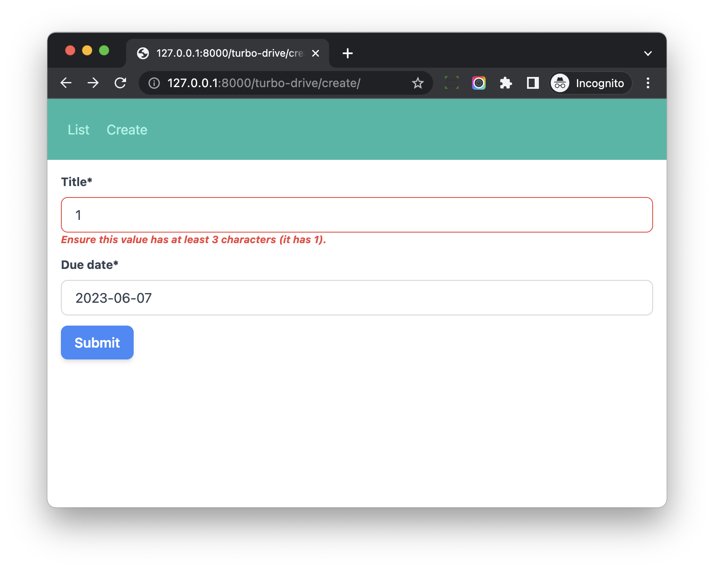

# Turbo Drive and Django Form Validation

## Objective

1. Learn how to make Django form validation work with Turbo

## Django Form Validation

Please go to [http://127.0.0.1:8000/turbo-drive/create/](http://127.0.0.1:8000/turbo-drive/create/)

And type **only one character** in the title field, then submit the form, which will cause the form validation fail.

We hope to see the Django form validation error.

However, it does not work, and we see `Form responses must redirect to another location` in the console of the browser devtool.

In Turbo, we need to return `422 Unprocessable Entity` status code so Turbo can display the form error message.

> when the response is rendered with either a 4xx or 5xx status code. This allows form validation errors to be rendered by having the server respond with "422 Unprocessable Entity" and a broken server to display a “Something Went Wrong” screen on a 500 Internal Server Error.

More details can be found on [https://turbo.hotwired.dev/handbook/drive#redirecting-after-a-form-submission](https://turbo.hotwired.dev/handbook/drive#redirecting-after-a-form-submission)

:::info

In django-turbo-helper 4.1.2, this issue has been solved with `turbo_helper.middleware.TurboMiddleware`, please check [https://django-turbo-helper.readthedocs.io/en/latest/form-submission.html](https://django-turbo-helper.readthedocs.io/en/latest/form-submission.html)

:::

**In Django, by default, `form validation fail` response still has `200` status code, so we should update the code to return `422` status code instead.**

## View

Let's update *hotwire_django_app/turbo_drive/views.py*

```python
def create_view(request):
    import time
    time.sleep(1)
    if request.method == 'POST':
        form = TaskForm(request.POST)
        if form.is_valid():
            form.save()

            messages.success(request, 'Task created successfully')
            return redirect(reverse('turbo-drive:task-list'))

        status = 422                 # new
    else:
        status = 200                 # new
        form = TaskForm()

    return render(request, 'turbo_drive/create.html', {'form': form}, status=status)    # new
```

Notes:

1. If form validation fail, we return `422` status code.

If we do a simple test



Let's update *hotwire_django_app/turbo_drive/views.py*

```python
import http


def create_view(request):
    import time
    time.sleep(1)
    if request.method == 'POST':
        form = TaskForm(request.POST)
        if form.is_valid():
            form.save()

            messages.success(request, 'Task created successfully')
            return redirect(reverse('turbo-drive:task-list'))

        status = http.HTTPStatus.UNPROCESSABLE_ENTITY                     # update
    else:
        status = http.HTTPStatus.OK                                       # update
        form = TaskForm()

    return render(request, 'turbo_drive/create.html', {'form': form}, status=status)
```

Now the code is more readable, and it can still work with Turbo.

## Redirect After Form Submission

Even [Turbo Doc](https://turbo.hotwired.dev/handbook/drive#redirecting-after-a-form-submission) say it expects `an HTTP 303 redirect response`, it seems Turbo can also work with `302` and `301` HTTP code, which used by Django `HttpResponseRedirect` and `HttpResponsePermanentRedirect`

## Workflow

> Turbo Drive handles form submissions in a manner similar to link clicks. The key difference is that form submissions can issue stateful requests using the HTTP POST method, while link clicks only ever issue stateless HTTP GET requests.

1. When we submit the form, Turbo starts handling the form submission.
1. It sends POST request to the backend server (please note the POST request is sent by Turbo here, instead of web browser).
1. If the response status code is `422`, Turbo knows the form validation fail and render the page content (without page reload, for better user experience). 
1. If the response status code is `302` or `301`, Turbo Drive will visit the URL like normal application visit.

From [https://turbo.hotwired.dev/reference/events](https://turbo.hotwired.dev/reference/events), `turbo:submit-start` fires during a form submission

Update *frontend/src/application/turbo_drive.js*

```js
document.addEventListener("turbo:submit-start", function ({target}) {
    console.log('turbo:submit-start');
    console.log(target);
});
```

If we submit the form, we can see the form element in the console

In real web projects, we can write JS to improve the form submission experience:

1. Disable form submit button to avoid duplicate requests.
1. Display spinner icon to indicate the form is submitting.

We will learn how to do this in later chapter.

## Unprocessable Entity

When we plan to import Turbo to our Django project, we should make sure Django return `422`  when form validation fail.

Things might be a little hard for some 3-party packages (for example, django-allauth), which still return `200` when form validation fail.

Below are some solutions:

1. Add `data-turbo="false"` to the specific form to disable `Turbo Drive` on some specific pages.
1. Patch Django `FormMixin.form_invalid` to return 422 when form validation fail, this can make all Django CBV work with Turbo Drive.

## Conclusion

I wish you already understand how Turbo Drive works and how to make it to bring better user experience to your Django project.

Next, we will learn how to use Turbo Stream to do partial page update without page reload.
