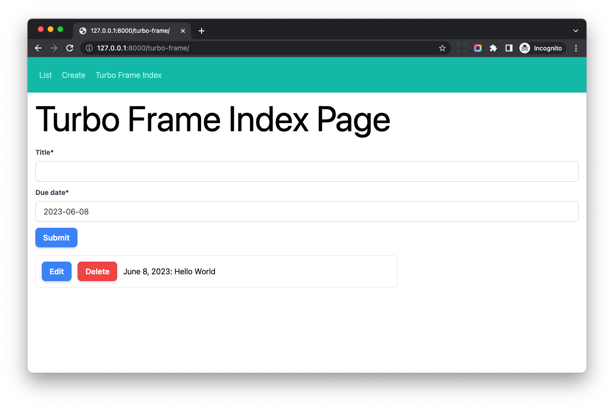
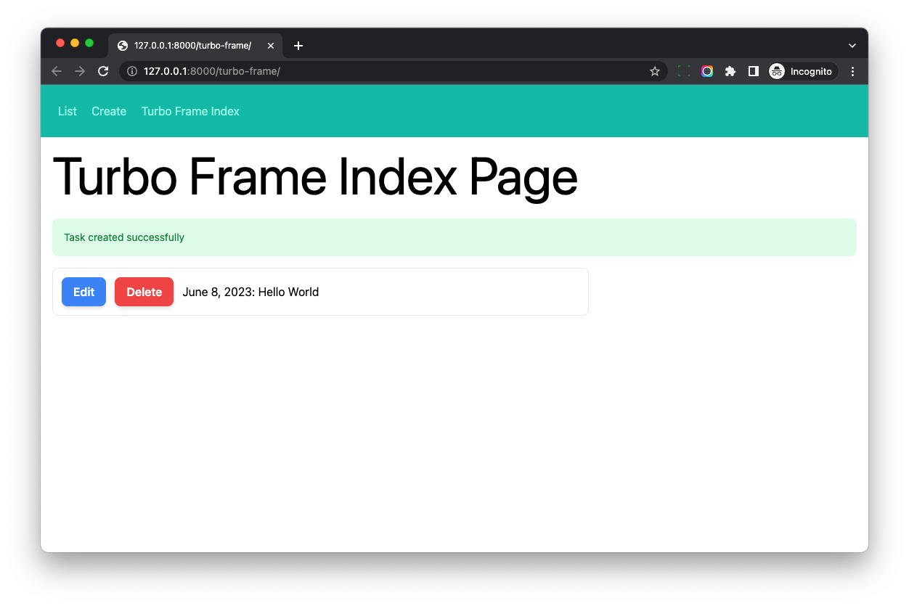

# Turbo Frame and Django Form

## Objective

1. Learn to make Django form work with Turbo Frame

## Load Django Form in Turbo Frame

Update *hotwire_django_app/templates/turbo_frame/index.html*

```html




<div class="w-full max-w-7xl mx-auto px-4">

  <h1 class="text-4xl sm:text-6xl lg:text-7xl mb-6">Turbo Frame Index Page</h1>

  <div class="mb-4">
    <turbo-frame id="task-create" src="">   <!-- new -->
      Loading...
    </turbo-frame>
  </div>

  <turbo-frame id="task-list" src="">    <!-- update -->
    Loading...
  </turbo-frame>

</div>


```

Notes:

1. We set `src` to the turbo frame to do `eager loading`, so it would load content and fill the `turbo-frame` element automatically.
1. We add `task-create` frame to load the form from the `turbo-frame:task-create`

Update *hotwire_django_app/templates/turbo_frame/create_page.html* to add the `<turbo-frame id="task-create">`

```html





<div class="w-full max-w-7xl mx-auto px-4">

  <h1 class="text-4xl sm:text-6xl lg:text-7xl mb-6">Create Task</h1>

  <turbo-frame id="task-create"> <! --- new --->
    <form method="post">
      

      {{ form|crispy }}

      <button type="submit" class="btn-blue">Submit</button>
    </form>
  </turbo-frame>

</div>


```

Now if we check [http://127.0.0.1:8000/turbo-frame/](http://127.0.0.1:8000/turbo-frame/), we should see the task create form on the top of the page.



## Form Action

If we try to submit the form on the index page, it would fail.

Let's check the network, the POST request is sent to `http://127.0.0.1:8000/turbo-frame/`, which is wrong. Because the `action` of the form is not set yet.

Let's update *hotwire_django_app/templates/turbo_frame/create_page.html* to explicitly set `action` to the form element.

```html





<div class="w-full max-w-7xl mx-auto px-4">

  <h1 class="text-4xl sm:text-6xl lg:text-7xl mb-6">Create Task</h1>

  <turbo-frame id="task-create">
    <form method="post" action="">   <!-- update -->
      

      {{ form|crispy }}

      <button type="submit" class="btn-blue">Submit</button>
    </form>
  </turbo-frame>

</div>


```

1. If we type **one letter** in the `title` field and submit the form.
1. The form validation would fail, and we can see the form error on the index page immediately, without page reload.
1. If the form validation succeed, Django server would return `302` response, and Turbo will visit the list page, since no Turbo frame `task-create` is found, we will see `Content missing` on the page. We will fix it in the next section.

## Form Response

> Any request triggered by an interaction within the Turbo Frame will include a "Turbo-Frame" header

So in Django view, we can check the request header, and then decide to return normal HTTP response or Turbo Frame response.

If the form is valid and from Turbo Frame, we return HTML which contains `turbo-frame` tag.

If the form is valid but not from Turbo Frame, we redirect to the detail page.

Update *hotwire_django_app/turbo_frame/views.py*

```python
from django.http import HttpResponse


def create_view(request):
    if request.method == 'POST':
        form = TaskForm(request.POST)
        if form.is_valid():
            instance = form.save()

            if 'Turbo-Frame' in request.headers:    # new
                # if the request comes within Turbo Frame
                text = """                               
                <turbo-frame id="task-create">
                    Task created successfully 
                </turbo-frame> 
                """
                return HttpResponse(text)
            else:
                messages.success(request, 'Task created successfully')
                return redirect(reverse('turbo-frame:task-detail', kwargs={'pk': instance.pk}))

        status = http.HTTPStatus.UNPROCESSABLE_ENTITY
    else:
        status = http.HTTPStatus.OK
        form = TaskForm()

    return render(request, 'turbo_frame/create_page.html', {'form': form}, status=status)
```

Let's submit the form on the index page, we can see the `Task created successfully` message.

As you can see, if the request was sent from Turbo Frame, **we can return `<turbo-frame>` element to update the page content without refresh**, without writing any JavaScript code.

## Install django-turbo-response

**It is tedious to write raw HTML in Django view**, let's use some tool to help us.

Next, let's use [django-turbo-response](https://github.com/hotwire-django/django-turbo-response) to help us better render Turbo Frame.

Add `django-turbo-response==0.0.52` to the *requirements.txt*

```
django-turbo-response==0.0.52
```

```bash
(venv)$ pip install -r requirements.txt
```

Update *hotwire_django_app/settings.py*

```python
INSTALLED_APPS = [
    'turbo_response',                # new
]


MIDDLEWARE = [
    'django.middleware.security.SecurityMiddleware',
    'turbo_response.middleware.TurboMiddleware',            # new
    ...
]
```

Notes:

1. Add `turbo_response` to the `INSTALLED_APPS`
2. Add `turbo_response.middleware.TurboMiddleware` to the `MIDDLEWARE`

Now `django-turbo-response` has been installed, let's use it in our project.

## Return Turbo Response Using django-turbo-response

Update *hotwire_django_app/turbo_frame/views.py*

```python
from turbo_response import TurboFrame


def create_view(request):
    if request.method == 'POST':
        form = TaskForm(request.POST)
        if form.is_valid():
            instance = form.save()

            messages.success(request, 'Task created successfully')
            if request.turbo.frame:
                # if the request comes within Turbo Frame
                response = TurboFrame(
                    request.turbo.frame
                ).template('turbo_frame/messages.html', {}).response(request)      # new
                return response
            else:
                return redirect(reverse('turbo-frame:task-detail', kwargs={'pk': instance.pk}))

        status = http.HTTPStatus.UNPROCESSABLE_ENTITY
    else:
        status = http.HTTPStatus.OK
        form = TaskForm()

    return render(request, 'turbo_frame/create_page.html', {'form': form}, status=status)
```

1. `request.turbo.frame` contains `Turbo-Frame` header from the request, it is set by `turbo_response.middleware.TurboMiddleware`
1. We use `TurboFrame` to return a template response, which contains the successful message.



## Fix Form On The Standard Page

Visit [http://127.0.0.1:8000/turbo-frame/create/](http://127.0.0.1:8000/turbo-frame/create/), and try to create a new Task.

We will see the successful message, but not get redirected to the task detail page, let's fix it.

### Template

Create *hotwire_django_app/templates/turbo_frame/form/create.html*

```html


<form method="post" action="">
  

  {{ form|crispy }}

  <button type="submit" class="btn-blue">Submit</button>
</form>
```

We extract the form code from `create_page.html` to `form/create.html`

Update *hotwire_django_app/templates/turbo_frame/create_page.html*

```html




<div class="w-full max-w-7xl mx-auto px-4">

  <h1 class="text-4xl sm:text-6xl lg:text-7xl mb-6">Create Task</h1>

  
    <turbo-frame id="task-create">
      
    </turbo-frame>
  
    
  

</div>


```

The logic is simple, we only render `turbo-frame` element, if the HTTP request has `Turbo-Frame` header.

1. If we create task on [http://127.0.0.1:8000/turbo-frame/](http://127.0.0.1:8000/turbo-frame/), the Django view will return Turbo response.
1. If we create task on [http://127.0.0.1:8000/turbo-frame/create/](http://127.0.0.1:8000/turbo-frame/create/) the Django view will return 302 response.

The benefit of this approach is, we **reused** the template code, and make the Django view works for both Turbo Frame and standard pages.

In real projects, this can also help us migrate the project to Turbo Frame step by step, without bringing too much changes to the existing code.
