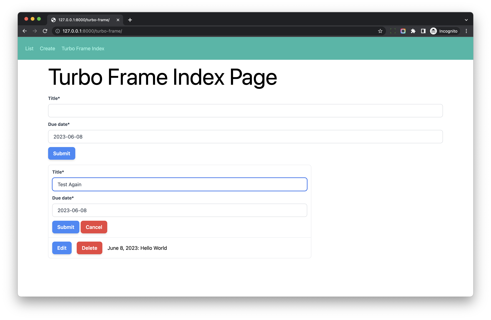

# Inline Editing With Turbo Frames

## Objective

1. Learn how to do inline editing with Turbo Frames

## Detail

### Template

Update *hotwire_django_app/templates/turbo_frame/task_detail.html*

```html
<turbo-frame id="task-detail-{{ instance.pk }}" class="flex-1">        <! --- new --->

  <a class="btn-blue mr-3" href="">
    Edit
  </a>
  <a class="btn-red mr-3" href="">
    Delete
  </a>

  {{ instance.due_date }}: {{ instance.title }}

</turbo-frame>
```

Now, in the `<turbo-frame id="task-list">`, every `li` element contains `<turbo-frame id="task-detail-{{ instance.pk }}"`

It should look like this

```html

<ul id="task-list-ul">
  <li>
    <turbo-frame id="task-detail-1">
      Task Detail 1
    </turbo-frame>
  </li>

  <li>
    <turbo-frame id="task-detail-2">
      Task Detail 2
    </turbo-frame>
  </li>
</ul>
```

1. If we click button inside the `turbo-frame id="task-detail-{{ instance.pk }}"`, the task detail would be updated within the `li` element.
2. On the server side, we can return Turbo Frame to only update specific `turbo-frame id="task-detail-{{ instance.pk }}"`

## Edit

### View

Update *hotwire_django_app/turbo_frame/views.py*

```python
def update_view(request, pk):
    instance = get_object_or_404(Task, pk=pk)
    if request.method == 'POST':
        form = TaskForm(request.POST, instance=instance)
        if form.is_valid():
            form.save()

            if request.turbo.frame:
                # if request come from Turbo Frame
                return redirect(reverse('turbo-frame:task-detail', kwargs={'pk': instance.pk}))
            else:
                # if request come from standard page
                messages.success(request, 'Task update successfully')
                return redirect(reverse('turbo-frame:task-detail', kwargs={'pk': instance.pk}))

        status = http.HTTPStatus.UNPROCESSABLE_ENTITY
    else:
        status = http.HTTPStatus.OK
        form = TaskForm(instance=instance)

    return render(request, 'turbo_frame/update_page.html', {'form': form}, status=status)
```

### Template

Create *hotwire_django_app/templates/turbo_frame/form/update.html*

```html


<form method="post" action="">

  

  {{ form|crispy }}

  <button type="submit" class="btn-blue">Submit</button>

  
    <a href="" class="btn-red">Cancel</a>
  
    <a href="" class="btn-red">Cancel</a>
  

</form>
```

If the request has Turbo Frame header, the `Cancel` link points to the task detail URL.

Update *hotwire_django_app/templates/turbo_frame/update_page.html*

```html



<div class="w-full max-w-7xl mx-auto px-4">

  <h1 class="text-4xl sm:text-6xl lg:text-7xl mb-6">Edit Task</h1>

  
  <turbo-frame id="{{ request.turbo.frame }}">
    
  </turbo-frame>
  
    
  
</div>


```

## Delete

### View

Update *hotwire_django_app/turbo_frame/views.py*

```python
def delete_view(request, pk):
    instance = get_object_or_404(Task, pk=pk)
    if request.method == 'POST':
        instance.delete()

        if request.turbo.frame:
            # if request come from Turbo Frame
            response = TurboFrame(f"task-detail-{pk}").response('')            # new
            return response
        else:
            # if request come from standard page
            messages.success(request, 'Task deleted successfully')
            return redirect('turbo-frame:task-list')

    return render(request, 'turbo_frame/delete_page.html', {'instance': instance})
```

Here we return empty HTML for Turbo Frame to replace the content of the frame.

### Template

Create *hotwire_django_app/templates/turbo_frame/form/delete.html*

```html


<form method="post" action="">
  

  <div class="p-4 mb-4 text-sm text-red-700 bg-red-100 rounded-lg dark:bg-red-200 dark:text-red-800" role="alert">
    Are you sure you want to delete "{{ instance.title }}"?
  </div>

  {{ form|crispy }}

  <button type="submit" class="btn-blue">Submit</button>

  
    <a href="" class="btn-red">Cancel</a>
  
    <a href="" class="btn-red">Cancel</a>
  

</form>
```

Update *hotwire_django_app/templates/turbo_frame/delete_page.html*

```html




  <div class="w-full max-w-7xl mx-auto px-4">
    <h1 class="text-4xl sm:text-6xl lg:text-7xl mb-6">Delete Task</h1>

    
      <turbo-frame id="{{ request.turbo.frame }}">
        
      </turbo-frame>
    
      
    

  </div>

```

## Manual Test

### Test 1

1. Now visit [http://127.0.0.1:8000/turbo-frame/](http://127.0.0.1:8000/turbo-frame/)
2. We pick one task and click `Edit` button to edit the task
3. Turbo sent request to `http://127.0.0.1:8000/turbo-frame/{pk}/update/`, since the button was in `<turbo-frame>` element, the request has `Turbo Frame` header.
4. Django server return response which contains `<turbo-frame id="task-detail-{pk}">`
5. The specific `turbo-frame` will be updated to display the `edit form`, so we can do inline editing.
6. We edit the task and then click `submit` button to submit the form.
7. If the form validation succeed, Django server will return `redirect` response.
8. Turbo send request to `http://127.0.0.1:8000/turbo-frame/{pk}/`, and the `<turbo-frame id="task-detail-{pk}">` in the response will be used to update the content of the specific `turbo-frame`.



### Test 2

1. Now visit [http://127.0.0.1:8000/turbo-frame/](http://127.0.0.1:8000/turbo-frame/)
2. We pick one task and click `Delete` button to delete the task
3. Turbo sent request to `http://127.0.0.1:8000/turbo-frame/{pk}/delete/`, since the button was in `<turbo-frame>` element, the request has `Turbo Frame` header.
4. Django server return response which contains `<turbo-frame id="task-detail-{pk}">` but the **content is empty**.
5. So the `turbo-frame` element will be updated to display the empty content
6. We should find a way to remove the whole `li` element from the `ul`, I will talk about the solution `Turbo Stream` in later chapter.

## Conclusion

In this chapter, we have learned how to use Turbo Frame to do inline editing, please use browser devtool to check the request and response and make sure you understand how it works.

We will keep improving the total workflow in the next chapters.