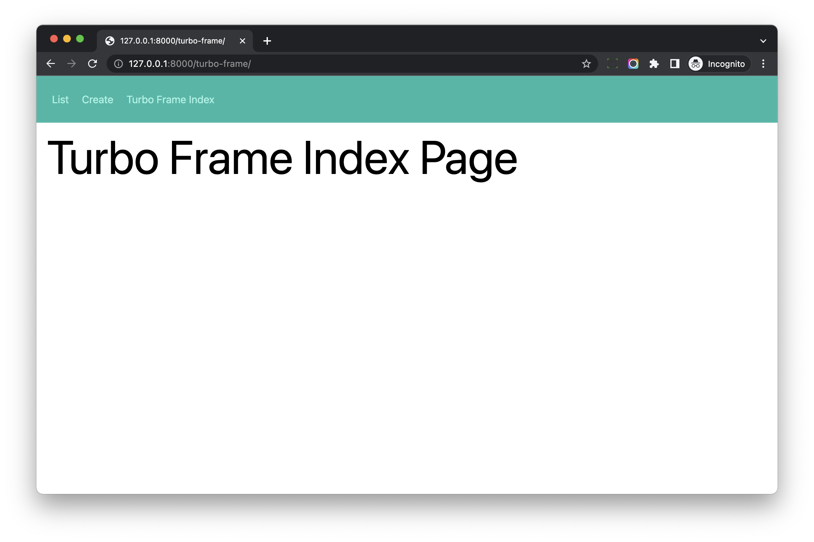
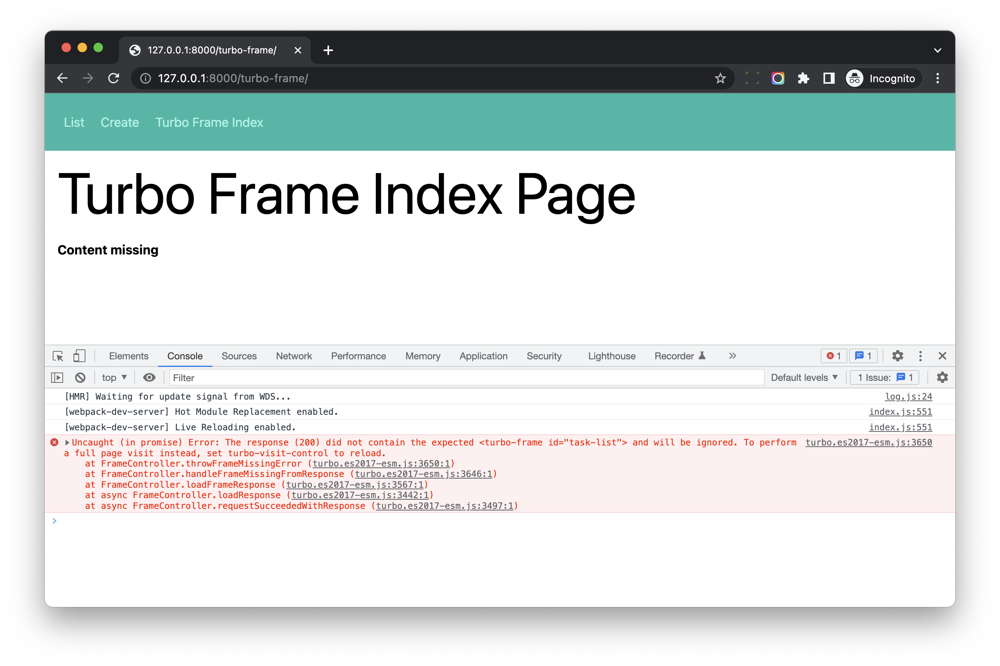

# Turbo Frame Basics

## Objective

1. Learn what is Turbo Frame
1. Understand how Turbo Frame works

## What is Turbo Frame

Turbo Frame can help us treat part of our page like HTML `iframe` element.

> Turbo Frames allow predefined parts of a page to be updated on request. Any links and forms inside a frame are captured, and the frame contents automatically updated after receiving a response.

With Turbo Frame, we can update segment of our page without reloading the whole page.

## Simple Example

Let's first create an `index` page in the `turbo_frame` Django app.

### View

Update *hotwire_django_app/turbo_frame/views.py*

```python
def index_view(request):
    return render(request, 'turbo_frame/index.html')
```

We added a `index_view`

### Template

Create *hotwire_django_app/templates/turbo_frame/index.html*

```html




  <div class="w-full max-w-7xl mx-auto px-4">

    <h1 class="text-4xl sm:text-6xl lg:text-7xl mb-6">Turbo Frame Index Page</h1>

  </div>


```

We create a simple index page, we will update it in a bit.

Update *hotwire_django_app/templates/turbo_frame/navbar.html* to add `` link

```html
<nav class="flex items-center justify-between flex-wrap bg-teal-500 p-6 mb-4">
  <div class="w-full">
    <a href="" class="inline-block mt-0 text-teal-200 hover:text-white mr-4">
      List
    </a>
    <a href="" class="inline-block mt-0 text-teal-200 hover:text-white mr-4">
      Create
    </a>
    <a href="" class="inline-block mt-0 text-teal-200 hover:text-white mr-4">
      Turbo Frame Index
    </a>
  </div>
</nav>
```

We add `Turbo Frame Index` link to the top navbar.

### URL

Update *hotwire_django_app/turbo_frame/urls.py*

```python
from django.urls import path
from .views import list_view, create_view, update_view, delete_view, detail_view, index_view    # update

app_name = 'turbo-frame'

urlpatterns = [
    path('', index_view, name='index'),                 # new
    path('list/', list_view, name='task-list'),
    path('create/', create_view, name='task-create'),
    path('<int:pk>/', detail_view, name='task-detail'),
    path('<int:pk>/update/', update_view, name='task-update'),
    path('<int:pk>/delete/', delete_view, name='task-delete'),
]
```

### Test

Test on [http://127.0.0.1:8000/turbo-frame/](http://127.0.0.1:8000/turbo-frame/), we can see an empty page.



## Add Turbo Frame

Update *hotwire_django_app/templates/turbo_frame/index.html*

```html




<div class="w-full max-w-7xl mx-auto px-4">

  <h1 class="text-4xl sm:text-6xl lg:text-7xl mb-6">Turbo Frame Index Page</h1>

  <turbo-frame id="task-list">     <!-- new -->
    <a class="btn-blue" href="">Click me to load</a>
  </turbo-frame>

</div>


```

Notes:

1. We add `turbo-frame` element to the index page.
1. It contains a link, if we click the link, Turbo will capture the event, and load the url to **update the content of the frame**

If we click the link on [http://127.0.0.1:8000/turbo-frame/](http://127.0.0.1:8000/turbo-frame/)

In the browser devtool, we can see http request has been sent to visit `http://127.0.0.1:8000/turbo-frame/list/`, but the content of the turbo-frame is not updated.

We can also see `The response (200) did not contain the expected <turbo-frame id="task-list"> and will be ignored.` from the console of the devtool.



> Each turbo frame must have a unique ID, which is used to match the content being replaced when requesting new pages from the server

Let's update *hotwire_django_app/templates/turbo_frame/list_page.html*

```html




<div class="w-full max-w-7xl mx-auto px-4">
  <h1 class="text-4xl sm:text-6xl lg:text-7xl mb-6">Task List</h1>

  <turbo-frame id="task-list">               <!-- new -->
    <div class="md:w-2/3 bg-white rounded-lg border mb-4">
      <ul class="divide-y-2 divide-gray-100" id="task-list-ul">
        
        <li class="p-3 flex items-center">

          

        </li>
        
      </ul>
    </div>
  </turbo-frame>

</div>


```

1. We use `turbo-frame id="task-list"` to wrap the list div.

Now test again.

1. If we click the link, Turbo will send request to fetch the list page.
1. After getting the response, Turbo will update the content of the `<turbo-frame id="task-list">`

## Notes

Actually, this feature can also be done using valina Javascript, but `turbo-frame` helps us get things done in a more clean way.
