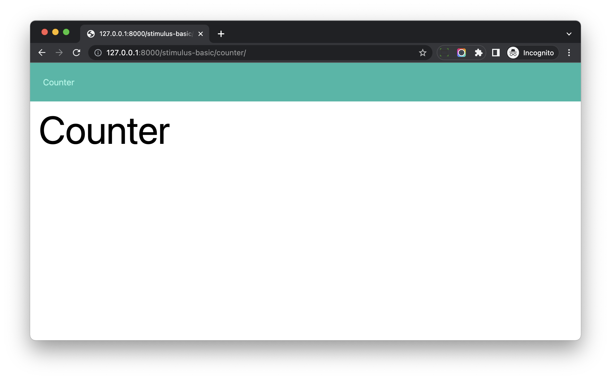

# Prepare Django app to learn Stimulus Basics

## Objective

1. Prepare Django app for us to learn `Stimulus`

## Django App

Let's create a Django app for us to test and learn Stimulus.

```bash
(venv)$ mkdir -p ./hotwire_django_app/stimulus_basic
(venv)$ python manage.py startapp stimulus_basic ./hotwire_django_app/stimulus_basic
```

We will have file structure like this

```
./hotwire_django_app
├── __init__.py
├── asgi.py
├── settings.py
├── stimulus_basic                       # new
├── tasks
├── templates
├── turbo_drive
├── turbo_frame
├── urls.py
└── wsgi.py
```

Update *hotwire_django_app/stimulus_basic/apps.py* to change the name to `hotwire_django_app.stimulus_basic`

```python
from django.apps import AppConfig


class StimulusBasicConfig(AppConfig):
    default_auto_field = 'django.db.models.BigAutoField'
    name = 'hotwire_django_app.stimulus_basic'                  # update
```

Add `hotwire_django_app.stimulus_basic` to the `INSTALLED_APPS` in *hotwire_django_app/settings.py*

```python
INSTALLED_APPS = [
	...
    'hotwire_django_app.stimulus_basic',                  # new
]
```

```bash
# check if there is any error
$ ./manage.py check

System check identified no issues (0 silenced).
```

## View

Update *hotwire_django_app/stimulus_basic/views.py*

```python
from django.shortcuts import render


def counter_view(request):
    return render(request, 'stimulus_basic/counter.html')
```

## Template

Create *hotwire_django_app/templates/stimulus_basic/base.html*

```html


<!DOCTYPE html>
<html>
<head>
  <meta charset="utf-8" />
  <meta name="viewport" content="width=device-width, initial-scale=1.0">

  
  

</head>
<body>






</body>
</html>
```

Notes:

1. Please note in the template, we will use `stimulus_basic` entry file. we will create it in a bit.
   
Create *hotwire_django_app/templates/stimulus_basic/navbar.html*

```html
<nav class="flex items-center justify-between flex-wrap bg-teal-500 p-6 mb-4">
  <div class="w-full">
    <a href="" class="inline-block mt-0 text-teal-200 hover:text-white mr-4">
      Counter
    </a>
  </div>
</nav>
```

Please note the URL namespace is `stimulus-basic` now.

Create *hotwire_django_app/templates/stimulus_basic/counter.html*

```html




<div class="w-full max-w-7xl mx-auto px-4">

  <h1 class="text-4xl sm:text-6xl lg:text-7xl mb-6">Counter</h1>

</div>


```

## Frontend

Create *frontend/src/styles/stimulus_basic.scss*

```scss
@import "tailwindcss/base";
@import "tailwindcss/components";
@import "tailwindcss/utilities";
```

Create *frontend/src/application/stimulus_basic.js*

```js
// This is the scss entry file
import "../styles/stimulus_basic.scss";

import "@hotwired/turbo";
```

Notes:

1. We import `stimulus_basic.scss` we just created
1. And this JS entry file would be used by the above `stimulus_basic/base.html`

## URL

Create *hotwire_django_app/stimulus_basic/urls.py*

```python
from django.urls import path
from .views import counter_view

app_name = 'stimulus-basic'

urlpatterns = [
    path('counter/', counter_view, name='counter'),
]
```

Notes:

1. Here we use `app_name` to set the `namespace` of the Django app.

Update *hotwire_django_app/urls.py*

```python
from django.contrib import admin
from django.urls import path, include
from django.views.generic import TemplateView

urlpatterns = [
    path('', TemplateView.as_view(template_name="index.html")),
    path('turbo-drive/', include('hotwire_django_app.turbo_drive.urls')),
    path('turbo-frame/', include('hotwire_django_app.turbo_frame.urls')),
    path('stimulus-basic/', include('hotwire_django_app.stimulus_basic.urls')),        # new
    path('admin/', admin.site.urls),
]
```

## Manual test

Restart `webpack`, so the new entry file can work

```bash
$ npm run start
```

```bash
(venv)$ python manage.py runserver
```

Visit [http://127.0.0.1:8000/stimulus-basic/counter/](http://127.0.0.1:8000/stimulus-basic/counter/), you can see an empty page.



Now we have a Django app for us to test and learn Stimulus.
