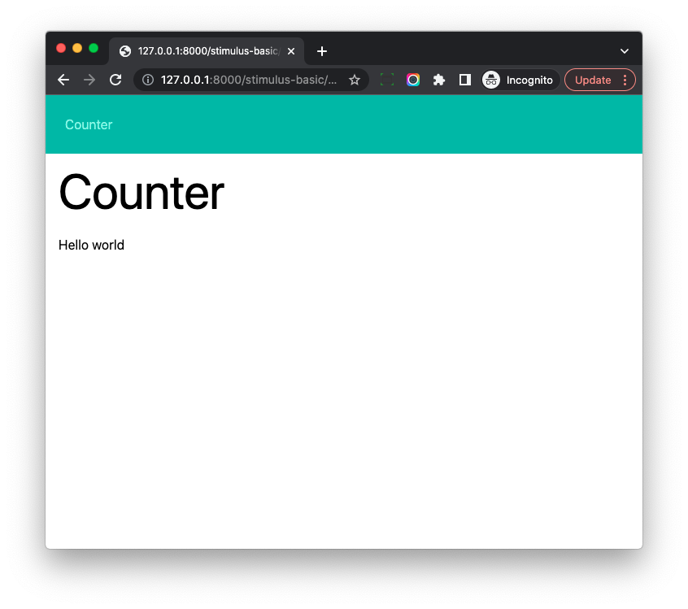

# Stimulus Controller Basics

## Objective

1. Learn to install Stimulus.
1. Write the first Stimulus Controller.

## Introduction

> Stimulus is a JavaScript framework with modest ambitions. Unlike other front-end frameworks, Stimulus is designed to enhance static or server-rendered HTML—the “HTML you already have”—by connecting JavaScript objects to elements on the page using simple annotations.

We can:

1. Use the classic dev frameworks such as Django, Rails to render HTML.
1. Use `Stimulus` to attach JS to the DOM elements (handle events, do DOM manipulation).

## Install Stimulus

```bash
$ npm install --save-exact @hotwired/stimulus@3.2.1
```

Here we install `@hotwired/stimulus@3.2.1` (which is the latest version when I write this book), we use `--save-exact` to pin the version here to make the readers easy to troubleshoot in some cases.

If we check `package.json`

```
"dependencies": {
    "@hotwired/stimulus": "3.2.1",
}
```

## First Stimulus Controller

Let's do some cleanup work first

```bash
# those files are created by python-webpack-boilerplate
$ rm -rf frontend/src/components
$ rm -f frontend/src/application/app2.js
```

We will put all Stimulus controllers under the `controllers` directory.

Create *frontend/src/controllers/counter_controller.js*

```js
import { Controller } from '@hotwired/stimulus';

export default class extends Controller {
    connect() {
        this.element.innerHTML = 'Hello world';
    }
}
```

## Register Controller

Update *frontend/src/application/stimulus_basic.js*

```js
// This is the scss entry file
import "../styles/stimulus_basic.scss";

import "@hotwired/turbo";
import { Application } from "@hotwired/stimulus";

import CounterController from "../controllers/counter_controller";

window.Stimulus = Application.start();
window.Stimulus.register("counter", CounterController);
```

Notes:

1. We import `CounterController` and then `register` it with `Stimulus.register` method.

## How to use the controller

Update *hotwire_django_app/templates/stimulus_basic/counter.html*

```html




<div class="w-full max-w-7xl mx-auto px-4">

  <h1 class="text-4xl sm:text-6xl lg:text-7xl mb-6">Counter</h1>

  <div data-controller="counter"></div>                    <! --- new --->

</div>


```

Notes:

1. The key is `<div data-controller="counter"></div>`, we attach `counter` controller to the div element using `data-controller="counter"`

Let's run web server

```bash
# restart webpack
(venv)$ npm run start

# run on another terminal
(venv)$ python manage.py runserver
```

If we check on [http://127.0.0.1:8000/stimulus-basic/counter/](http://127.0.0.1:8000/stimulus-basic/counter/), we can see the text `hello world`



## Workflow

> Stimulus continuously monitors the page waiting for HTML data-controller attributes to appear. For each attribute, Stimulus looks at the attribute’s value to find a corresponding controller class, creates a new instance of that class, and connects it to the element.

1. Stimulus detects elements which have `data-controller` attribute.
2. Then it creates a new instance of the controller class (`counter` controller in this case), and connect it to the DOM element.
3. The controller's `connect` method will run. (It is a lifecycle method, we will talk about it later)
4. In *counter_controller.js*, `this.element` is reference to the connected DOM element, the DOM `innerHTML` is set to `Hello World` in this case.

## AutoLoading Controllers

It is tedious to register all the Stimulus controllers manually, let's make it `automatic`

```bash
$ npm install @hotwired/stimulus-webpack-helpers
```

Update *frontend/src/application/stimulus_basic.js*

```js
// This is the scss entry file
import "../styles/stimulus_basic.scss";

import "@hotwired/turbo";
import { Application } from "@hotwired/stimulus";
import { definitionsFromContext } from "@hotwired/stimulus-webpack-helpers";

window.Stimulus = Application.start();
const context = require.context("../controllers", true, /\.js$/);
window.Stimulus.load(definitionsFromContext(context));
```

With `require.context` (brought by `Webpack`), we pass the root directory of the controllers, and `definitionsFromContext` helps us generate controller names from the path and register them.

Please rerun `npm run start`, and then check on [http://127.0.0.1:8000/stimulus-basic/counter/](http://127.0.0.1:8000/stimulus-basic/counter/), it should still work as expected.

With `stimulus-webpack-helpers`, we do not need to manually register the controllers anymore, just put them under the `controllers` directory, and they will be registered automatically.

The filename of the controller JS file will determine the controller name, and below are some examples

1. `clipboard_controller.js -> clipboard`
2. `hello_world_controller.js -> hello-world`
3. `users/list_item_controller.js -> users--list-item`
