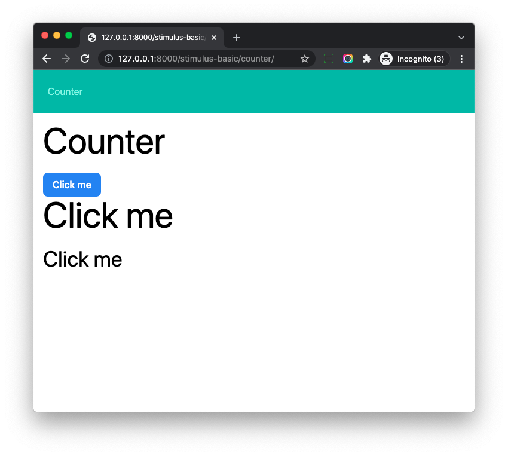

# Stimulus Controller (Actions, Values)

## Objective

1. Learn Stimulus Values and state management.
1. Learn Stimulus Actions.

## Controller Instance State

Update *frontend/src/controllers/counter_controller.js*

```js
import { Controller } from '@hotwired/stimulus';

export default class extends Controller {
    connect() {
        // set initial state
        this.count = 0;
        this.element.innerHTML = 'Click me';

        // setup event handler
        this.element.addEventListener('click', () => {
            this.count++;
            this.element.innerHTML = `You clicked ${this.count} times`;
        });
    }
}
```

Notes:

1. Here `this.count` is something like a `private` variable of the controller instance.
1. We use `this.element.addEventListener` to register event handler to the DOM element, if it is clicked, then the `this.count` will increase and the `innderHTML` will display the value.

Let's update *hotwire_django_app/templates/stimulus_basic/counter.html*

```html




<div class="w-full max-w-7xl mx-auto px-4">

  <h1 class="text-4xl sm:text-6xl lg:text-7xl mb-6">Counter</h1>

  <button class="px-4 py-2 bg-blue-500 hover:bg-blue-700 text-white font-semibold rounded-lg" data-controller="counter"></button>

  <h1 data-controller="counter" class="text-4xl sm:text-6xl lg:text-7xl mb-6"></h1>

  <div data-controller="counter" class="text-4xl"></div>

</div>


```

Notes:

1. We have `button`, `h1` and `div` elements on the page, all of them have `data-controller="counter"`
1. Stimulus will create **three controller instances** and connect the instances to the respective elements.

Visit [http://127.0.0.1:8000/stimulus-basic/counter/](http://127.0.0.1:8000/stimulus-basic/counter/)



We can click the elements and all of them should work as expected.

## Getter, Setter

Update *frontend/src/controllers/counter_controller.js*

```js
import { Controller } from '@hotwired/stimulus';

export default class extends Controller {
    connect() {
        // set initial state
        this.count = 0;
        this.element.innerHTML = 'Click me';

        // setup event handler
        this.element.addEventListener('click', () => {
            this.count++;
            this.element.innerHTML = `You clicked ${this.count} times`;
        });
    }

    get count() {
        return parseInt(this.element.dataset.count);
    }

    set count(value) {
        this.element.dataset.count = value;
    }

}
```

Notes:

1. We add `getter` and `setter` to the stimulus Controller class
2. The `getter` and `setter` can help write/read value to/from the DOM element dataset property, you can check [https://javascript.info/class#getters-setters](https://javascript.info/class#getters-setters) to learn more about the syntax.
3. If we set value using `this.count = 0`, the value would be set to the `dataset` of the DOM element.

Now if we check the element in the browser devtool, we can see `data-count` attributes like this

```html
<div data-controller="counter" class="text-4xl" data-count="4">You clicked 4 times</div>
```

## Stimulus Values

It is tedious to write `getter` and `setter` for each variable, and we can use Stimulus Values to simplify the code.

Update *frontend/src/controllers/counter_controller.js*

```js
import {Controller} from '@hotwired/stimulus';

export default class extends Controller {
  static values = {
    count: { type: Number, default: 0 },
  };

  connect() {
    // set initial state
    this.element.innerHTML = 'Click me';

    // setup event handler
    this.element.addEventListener('click', () => {
      this.countValue++;
      this.element.innerHTML = `You clicked ${this.countValue} times`;
    });
  }

  countValueChanged(value, previousValue) {
    console.log(`${previousValue} changed to ${value}`);
  }
}
```

Notes:

1. At the top, we defined static `values`, which has the value name, value type, and default value.
1. We can get or set the value using `this.countValue` (`Value` is the suffix) and Stimulus will help us read, do type conversion, and write DOM dataset property.
1. With Stimulus Value, we can remove the annoying `getter` and `setter` and the code is cleaner.
1. What is more, we can use `countValueChanged` as value change callback, this is very useful in some cases.

Now if we check the element in the `devtool`, we can see `data-counter-count-value` attribute, the controller name has been added as prefix to avoid potential conflict. (Because one DOM elements can have more than one Stimulus controller in some cases)

In the `console` tab, we can also see the log message

```
undefined changed to 0
0 changed to 1
1 changed to 2
2 changed to 3
3 changed to 4
```

You can check [https://stimulus.hotwired.dev/reference/values](https://stimulus.hotwired.dev/reference/values) to learn more.

## Actions

> Actions are how you handle DOM events in your controllers.

Update *frontend/src/controllers/counter_controller.js*

```js
import {Controller} from '@hotwired/stimulus';

export default class extends Controller {
  static values = {
    count: { type: Number, default: 0 },
  };

  connect() {
    this.element.innerHTML = 'Click me';
  }

  countValueChanged(value, previousValue) {
    console.log(`${previousValue} changed to ${value}`);
  }

  increment(){
    this.countValue++;
    this.element.innerHTML = `You clicked ${this.countValue} times`;
  }
}
```

1. Code `this.element.addEventListener` has been removed.
1. We created `increment` method to handle the click event of the DOM element.

Update *hotwire_django_app/templates/stimulus_basic/counter.html*

```html




<div class="w-full max-w-7xl mx-auto px-4">

  <h1 class="text-4xl sm:text-6xl lg:text-7xl mb-6">Counter</h1>

  <button
    class="px-4 py-2 bg-blue-500 hover:bg-blue-700 text-white font-semibold rounded-lg"
    data-controller="counter"
    data-action="click->counter#increment"
  ></button>       <!-- Update -->

  <h1 data-controller="counter" data-action="click->counter#increment" class="text-4xl sm:text-6xl lg:text-7xl mb-6"></h1>

  <div data-controller="counter" data-action="click->counter#increment" class="text-4xl"></div>

</div>


```

Notes:

1. We add `data-action="click->counter#increment"` to the HTML elements.
1. `click` is the event we want to listen.
1. `counter` is the controller name.
1. `increment` is the controller method we want to fire for the event we listen.
1. The `data-action` value means, the `click` event will fire `counter` controller `increment` method.

Now you can test on [http://127.0.0.1:8000/stimulus-basic/counter/](http://127.0.0.1:8000/stimulus-basic/counter/) and it should still work.

And the code is easy to understand and maintain.

Notes:

1. It seems `addEventListener` and `data-action` can do the same thing here, so which one is recommended?
1. When we use `addEventListener`, we should always remember to run `removeEventListener` in the `disconnect` method (which run when the controller is disconnected from the DOM tree). If we forget do so, some bugs might happen in some cases. (especially when we use Turbo)
1. `data-action` is better option in most cases.

You can check [https://stimulus.hotwired.dev/reference/actions](https://stimulus.hotwired.dev/reference/actions) to learn more.

## Conclusion

Let's check again our *counter.html*, with `data-controller` and `data-action`, we attach JS code and event handler to the DOM elements.

We can easily **reuse** code of `counter_controller.js` with other DOM elements.

The whole logic is in the JS code, with valina JS and Stimulus, we can write clean and maintainable code.