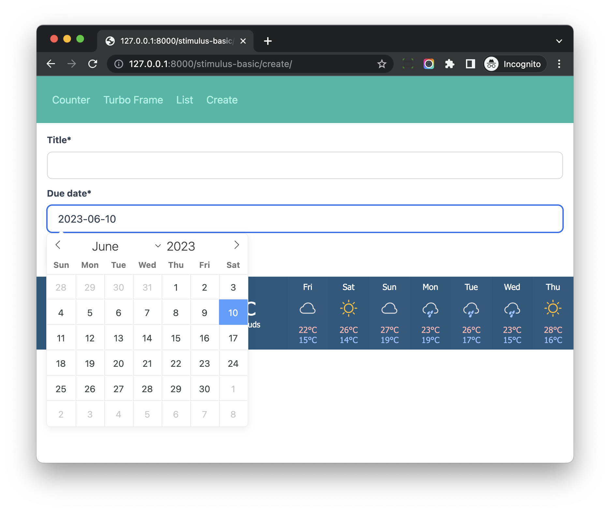

# Stimulus Controller (Date Picker)

## Objective

1. Use Stimulus Controller to build a Date Picker based on `flatpickr`

## Preparation

### View

Update *hotwire_django_app/stimulus_basic/views.py*

```python
import http
from django.shortcuts import render, redirect, reverse
from django.contrib import messages

from hotwire_django_app.tasks.forms import TaskForm
from hotwire_django_app.tasks.models import Task


def create_view(request):                         # new
    if request.method == 'POST':
        form = TaskForm(request.POST)
        if form.is_valid():
            form.save()

            messages.success(request, 'Task created successfully')
            return redirect(reverse('stimulus-basic:task-list'))

        status = http.HTTPStatus.UNPROCESSABLE_ENTITY
    else:
        status = http.HTTPStatus.OK
        form = TaskForm()

    return render(request, 'stimulus_basic/create_page.html', {'form': form}, status=status)


def list_view(request):                           # new
    object_list = Task.objects.all().order_by('-pk')

    context = {
        "object_list": object_list,
    }

    return render(request, 'stimulus_basic/list_page.html', context)
```

Notes:

1. We add `create_view` and `list_view`, which we will use in a bit.

### Template

Create *hotwire_django_app/templates/stimulus_basic/create_page.html*

```html





<div class="w-full max-w-7xl mx-auto px-4">

  <form method="post">
    

    {{ form|crispy }}

    <button type="submit" class="btn-blue">Submit</button>
  </form>

</div>


```

Create *hotwire_django_app/templates/stimulus_basic/list_page.html*

```html




<div class="w-full max-w-7xl mx-auto px-4">
  <h1 class="text-4xl sm:text-6xl lg:text-7xl mb-6">Task List</h1>
  <div class="md:w-2/3 bg-white rounded-lg border mb-4">
    <ul class="divide-y-2 divide-gray-100" id="task-list-ul">
      
      <li class="p-3 flex items-center">
        {{ instance.due_date|date:"Y-m-d" }}: {{ instance.title }}
      </li>
      
    </ul>
  </div>
</div>


```

Create *hotwire_django_app/templates/stimulus_basic/messages.html*

```html

{#  data-turbo-cache="false" will tell Turbo to not cache the element #}
<div data-turbo-cache="false" class="p-4 mb-4 text-sm text-green-700 bg-green-100 rounded-lg dark:bg-green-200 dark:text-green-800" role="alert">
  {{ message|safe }}
</div>

```

Update *hotwire_django_app/templates/stimulus_basic/navbar.html*

```html
<nav class="flex items-center justify-between flex-wrap bg-teal-500 p-6 mb-4">
  <div class="w-full">
    <a href="" class="inline-block mt-0 text-teal-200 hover:text-white mr-4">
      Counter
    </a>

    <a href="" class="inline-block mt-0 text-teal-200 hover:text-white mr-4">
      Turbo Frame
    </a>

    <a href="" class="inline-block mt-0 text-teal-200 hover:text-white mr-4">
      List
    </a>

    <a href="" class="inline-block mt-0 text-teal-200 hover:text-white mr-4">
      Create
    </a>

  </div>
</nav>
```

Notes:

1. We add `Create` and `List` link to the top navbar.

### URL

Update *hotwire_django_app/stimulus_basic/urls.py*

```python
from django.urls import path
from .views import counter_view, turbo_frame_load_view, create_view, list_view       # update

app_name = 'stimulus-basic'

urlpatterns = [
    path('counter/', counter_view, name='counter'),
    path('turbo_frame_load/', turbo_frame_load_view, name='turbo_frame_load'),
    path('list/', list_view, name='task-list'),                   # new
    path('create/', create_view, name='task-create'),             # new
]
```

## Frontend

Update *frontend/src/styles/stimulus_basic.scss*

```scss
@import "tailwindcss/base";
@import "tailwindcss/components";
@import "tailwindcss/utilities";

.btn-blue {
  @apply inline-flex items-center;
  @apply px-4 py-2;
  @apply font-semibold rounded-lg shadow-md;
  @apply text-white bg-blue-500;
  @apply hover:bg-blue-700 focus:outline-none focus:ring-2 focus:ring-blue-400 focus:ring-opacity-75;
}

.btn-red {
  @apply inline-flex items-center;
  @apply px-4 py-2;
  @apply font-semibold rounded-lg shadow-md;
  @apply text-white bg-red-500;
  @apply hover:bg-red-700 focus:outline-none focus:ring-2 focus:ring-red-400 focus:ring-opacity-75;
}
```

Here we append styles for `btn-blue` and `btn-red`

## Manual Test

1. Visit [http://127.0.0.1:8000/stimulus-basic/create/](http://127.0.0.1:8000/stimulus-basic/create/), we can see the Task form page.
1. Create a new Task, we will be redirected to the list page.

## Custom Form Widget

Update *hotwire_django_app/settings.py*

```python
INSTALLED_APPS = [
    'django.forms',              # new
]

FORM_RENDERER = 'django.forms.renderers.TemplatesSetting'      # new
```

Create *hotwire_django_app/templates/form/flatpickr_date.html*

```html

```

Update *hotwire_django_app/tasks/forms.py*

```python
from django import forms
from .models import Task


class CustomDateWidget(forms.widgets.DateInput):

    template_name = 'form/flatpickr_date.html'


class TaskForm(forms.ModelForm):

    class Meta:
        model = Task
        fields = ("title", "due_date")
        widgets = {
            'due_date': CustomDateWidget(),
        }
```

Notes:

1. We created a `CustomDateWidget` Django form widget, and set the template `form/flatpickr_date.html`
1. Test [http://127.0.0.1:8000/stimulus-basic/create/](http://127.0.0.1:8000/stimulus-basic/create/) to make sure no exception raised.

## Flatpickr

> flatpickr is a lightweight and powerful datetime picker.

> stimulus-flatpickr is a modest yet powerful wrapper of Flatpickr for Stimulus

```bash
$ npm install stimulus-flatpickr@3.0.0-0
$ npm install flatpickr
```

In the package.json, we can see:

```
"flatpickr": "^4.6.13",
"stimulus-flatpickr": "^3.0.0-0"
```

Create *frontend/src/controllers/flatpickr_controller.js*

```js
import Flatpickr from 'stimulus-flatpickr';

// Import style for flatpickr
import "flatpickr/dist/flatpickr.css";
import "flatpickr/dist/themes/airbnb.css";

export default class extends Flatpickr {

}
```

Notes:

1. We defined controller class which inherit from `stimulus-flatpickr` `Flatpickr`, **so we can extend the behavior if we like**.
1. Do not forget to import the css to make the theme work.

Update *hotwire_django_app/templates/form/flatpickr_date.html*

```html
<div>
  <input
    data-controller="flatpickr"
    data-flatpickr-enable-time="false"
    type="text"
    name="{{ widget.name }}"
    class="textinput py-2 leading-normal text-gray-700 bg-white px-4 appearance-none
      focus:outline-none rounded-lg w-full border-gray-300 block border"
    value="{{ widget.value }}"
    
  >
</div>
```

Notes:

1. `data-controller="flatpickr"` means `flatpickr` controller will connect to the `input` element in a bit.
1. `data-flatpickr-enable-time` can control if enable the `time` or not, which means we can create `CustomDateTime` widget which has `data-flatpickr-enable-time="true"`
1. We add some CSS class to make the widget work better with Tailwind.

Now if we click the form field, then a modal will display to let us select the date.



```
our flatpickr_controller.js 
    -> stimulus-flatpickr 
        -> flatpickr
```

You can check [https://github.com/adrienpoly/stimulus-flatpickr](https://github.com/adrienpoly/stimulus-flatpickr) to learn more.

## Notes:

As you can see, stimulus controller is like `Glue`, we can use it to write wrapper for 3-party NPM package or online resource.

We can use it to build form widgets which have great user experience.

And then we can use them with Django form by passing the `widget` to the field.

If you are interested in this topic, you can check `Component Library` on [https://saashammer.com/](https://saashammer.com/)
