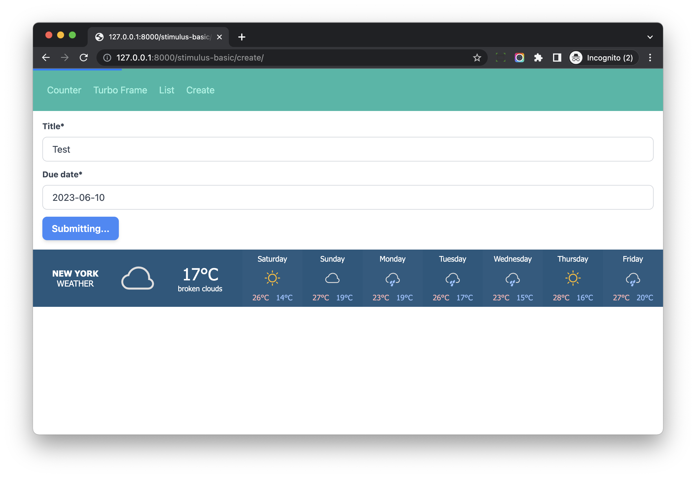
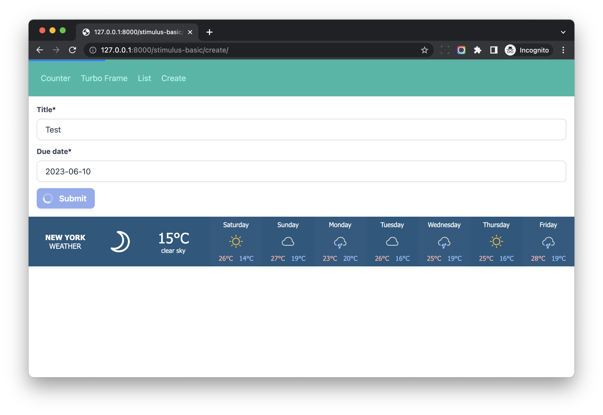

# Stimulus Controller (Form Submission)

## Objective

1. Improve form submission with Turbo
2. Use Stimulus Controller to improve form submission

## data-turbo-submits-with

Update *hotwire_django_app/templates/stimulus_basic/create_page.html*

```html





<div class="w-full max-w-7xl mx-auto px-4">

  <form method="post">
    

    {{ form|crispy }}

    <button
      type="submit"
      class="btn-blue"
      data-turbo-submits-with="Submitting..."
    >
      Submit
    </button>

  </form>

</div>


```

1. We add `data-turbo-submits-with="Submitting..."` to the submit button.
2. With `data-turbo-submits-with`, we can give user feedback by showing `Submitting...`, while the operation is in progress

If we submit the form, we can see something like this



Notes:

1. Button text has changed
2. Button text has restored after form submission.
3. Turbo do that for us automatically.

What if we want to display a spinner instead of text?

## Workflow

Since the form submission is handled by Turbo , let's check below Turbo events

1. `turbo:submit-start` fires during a form submission.
1. `turbo:submit-end` fires after the form submission-initiated network request completes

So we can do in this way:

1. We let the controller listen to the `turbo:submit-start` event and `turbo:submit-end` events.
1. When form submission start, we set `data-submitting=true` on the form element.
1. We add CSS to display a spinner when form `data-submitting` is `true`
1. When form submission finish, we set back `data-submitting=false`.

## Spinner

Create *hotwire_django_app/templates/stimulus_basic/spinner.html*

```html
<svg class="animate-spin -ml-1 mr-3 h-5 w-5 text-white" xmlns="http://www.w3.org/2000/svg" fill="none" viewBox="0 0 24 24">
  <circle class="opacity-25" cx="12" cy="12" r="10" stroke="currentColor" stroke-width="4"></circle>
  <path class="opacity-75" fill="currentColor" d="M4 12a8 8 0 018-8V0C5.373 0 0 5.373 0 12h4zm2 5.291A7.962 7.962 0 014 12H0c0 3.042 1.135 5.824 3 7.938l3-2.647z"></path>
</svg>
```

The svg come from [https://tailwindcss.com/docs/animation](https://tailwindcss.com/docs/animation)

## Form Controller

Create *frontend/src/controllers/form_controller.js*

```js
import { Controller } from '@hotwired/stimulus';

export default class extends Controller {
  static targets = ["submit"];

  disconnect() {
    this.enableSubmits();
    this.element.toggleAttribute("data-submitting", false);
  }

  disableSubmits() {
    this.submitTargets.forEach(
      function (submitTarget) {
        submitTarget.disabled = true;
      }
    );
  }

  enableSubmits() {
    this.submitTargets.forEach(
      function (submitTarget) {
        submitTarget.disabled = false;
      }
    );
  }

  submitStart() {
    const form = this.element;
    if (form) {
      form.toggleAttribute("data-submitting", true);
      this.disableSubmits();
    }
  }

  submitEnd() {
    const form = this.element;
    if (form) {
      form.toggleAttribute("data-submitting", false);
      this.enableSubmits();
    }
  }

}
```

Notes:

1. The form controller has `submit` target, which is the `submit` button.
1. In `submitStart`, we add attribute `data-submitting` to the form element and set `disabled=true` attribute to the `submit` target
1. In `submitEnd`, we remove `data-submitting` to the form element and set `disabled=false` attribute to the `submit` target.

## CSS

### tailwind.config.js

Update *tailwind.config.js*

```js
module.exports = {
    content: contentPaths,
    theme: {
        extend: {},
    },
    variants: {
        extend: {
            opacity: ['disabled'],                   // new
        }
    },
    plugins: [
        require('@tailwindcss/forms'),
    ],
};
```

We do this to make `disabled:opacity-XX` work in Tailwind.

### CSS

Update *frontend/src/styles/stimulus_basic.scss*

```scss
@import "tailwindcss/base";
@import "tailwindcss/components";
@import "tailwindcss/utilities";

.btn-blue {
  @apply inline-flex items-center;
  @apply px-4 py-2;
  @apply font-semibold rounded-lg shadow-md;
  @apply text-white bg-blue-500;
  @apply hover:bg-blue-700 focus:outline-none focus:ring-2 focus:ring-blue-400 focus:ring-opacity-75;
  @apply disabled:opacity-50;              // new
}

.btn-red {
  @apply inline-flex items-center;
  @apply px-4 py-2;
  @apply font-semibold rounded-lg shadow-md;
  @apply text-white bg-red-500;
  @apply hover:bg-red-700 focus:outline-none focus:ring-2 focus:ring-red-400 focus:ring-opacity-75;
  @apply disabled:opacity-50;              // new
}

form[data-controller="form"] {
  button[data-form-target="submit"] {
    svg { 
      @apply hidden;
    }
  }

  &[data-submitting] {
    button[data-form-target="submit"] {
      @apply cursor-not-allowed;

      svg {
        @apply inline-block;
      }
    }
  }
}
```

Notes:

1. We add `disabled:opacity-50` to `btn-blue` and `btn-red`, so if the button is disabled, the button color will change.
1. For the form which has `data-controller="form"`, by default, the svg in button is hidden, if the `data-submitting=true`, the svg icon will display.

## Template

Create *hotwire_django_app/templates/stimulus_basic/create_page.html*

```html





<div class="w-full max-w-7xl mx-auto px-4">

  <form
      method="post"
      data-controller="form"
      data-action="turbo:submit-start->form#submitStart turbo:submit-end->form#submitEnd"
  >
    

    {{ form|crispy }}

    <button data-form-target="submit" type="submit" class="btn-blue">
      
      Submit
    </button>
  </form>

</div>


```

Notes:

1. with `data-controller="form"`, `form controller` will connect to the DOM element.
1. With `data-action="turbo:submit-start->form#submitStart turbo:submit-end->form#submitEnd"`, the controller will listen to the `turbo:submit-start` and `turbo:submit-end` events.
1. We add `data-form-target="submit"` to the submit button, so the controller can access it without DOM searching.

Remember to restart `webpack` to load the new controller, and then test on [http://127.0.0.1:8000/stimulus-basic/create/](http://127.0.0.1:8000/stimulus-basic/create/)

When we submit the form, we should see the spinner in the button.



## Notes

Actually, we can also use the `form_controller` in the project which has no `Turbo` setup.

```html
<form method="post" action="" data-controller="form" data-action="submit->form#submitStart">
</form>
```

For example, we can use Stimulus to listen to the `form's submit event` and set `data-submitting=true` to the form element.
