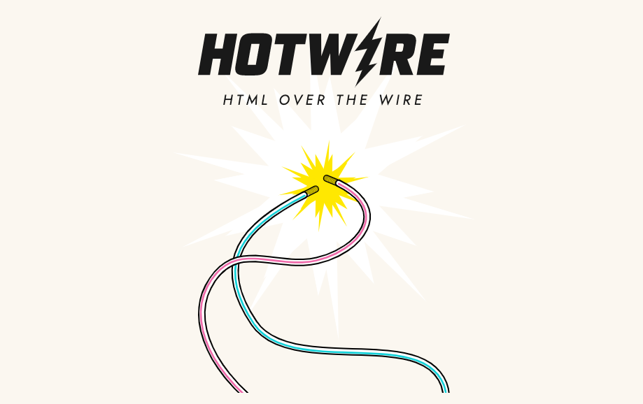

# Introduction

## About this book

This open source book (Hotwire Django Tutorial) is to help Django developers to learn **Hotwire**

> Hotwire is an alternative approach to building modern web applications without using much JavaScript by sending HTML instead of JSON over the wire.

Below are some popular websites built by Hotwire:

1. Github (https://github.com/), Github is built using Turbo and Catalyst (A tech inspired by Stimulus)
2. Hey (https://hey.com/), Hey is an email service and productivity platform that aims to revolutionize the way people manage their email
3. Basecamp (https://basecamp.com/), Basecamp is a project management and collaboration tool designed to help teams stay organized and work together effectively
4. Forem (https://github.com/forem/forem): Forem is an open-source platform for building online communities, [dev.to](https://dev.to/) is built using Forem.

Hotwire has become the default frontend solution in `Rails`, and it is also very popular in the `PHP` community (`Laravel`, `Symfony`).

For now, there is no good content about Hotwire in the Django community, so I decided to publish this book to help the developers.

## Objectives

By the end of this book, you will be able to:

1. Learn Hotwire includes `Turbo` and `Stimulus`, and what problem they can help solve.
1. Jump start frontend project bundled by Webpack.
1. Setup Turbo and Stimulus.
1. Learn how page navigation works in `Turbo Drive`
1. Understand what is cache in Turbo Drive and how preview works.
1. Learn what is `Stimulus` and how `Stimulus Controller` work.
1. What are Stimulus `Values`, `Targes`, and `Actions`
1. Use Stimulus to build a Datetime picker and improve the form submission process.
3. Learn about 15 UI examples (`inline editing`, `Type as Search`, `Form Validation`, etc.), which can help you solve the UI interaction problem in many cases.

With Hotwire, we can bring `SPA-like experience` to our Django web app:

1. We do NOT need heavy frontend solution such as React, Vue, which requires giving over control of the DOM to their framework
2. We do NOT need JSON and Django REST framework
3. We will stick with Django form, Django templates.

## Support

:::info

All the content of this **FREE** ebook come from [The Definitive Guide to Hotwire and Django](https://leanpub.com/hotwire-django)

If you are interested in Hotwire and want to learn more advanced stuff, please consider buying the book.

:::

## Questions

If you have any questions, please feel free to [open an issue](https://github.com/hotwire-django/hotwire-django-tutorial/issues)

## Contact

If you want to talk with the author Michael YIn, you can [follow me on Twitter](https://twitter.com/michaelyinplus)
